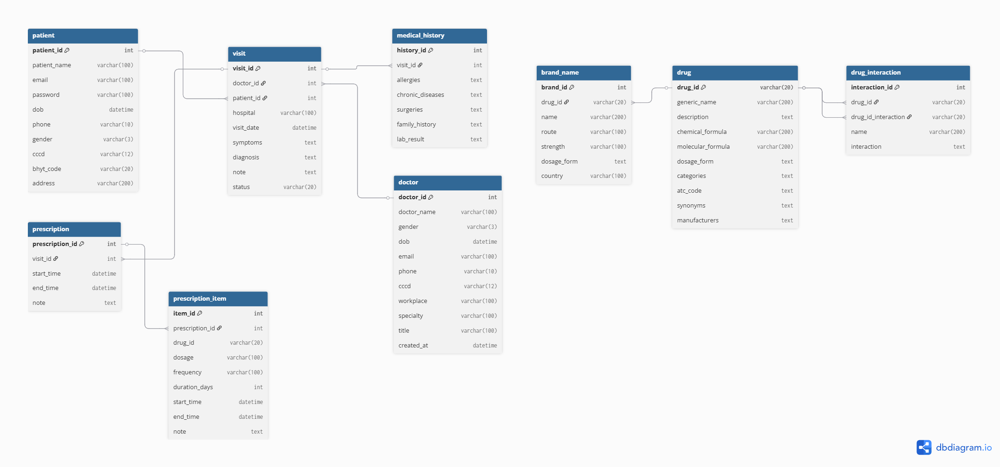

# AIDrugCare
Web Development Project: A Supportive Platform for Doctors to Manage Patient Consultations and Prescriptions, featuring advanced tools for drug management, patient records, and drug–drug interaction checks.

---

## Introduction
**AIDrugCare** is a next-generation **Clinical Decision Support System (CDSS)** powered by **deep learning** to predict and alert potential **drug–drug interactions (DDIs) in real time**. 

The system seamlessly integrates:  
- Patient record management  
- Drug interaction prediction and explanation  
- Electronic prescription  
- Centralized drug database management
  
Our goal is to empower healthcare professionals with **safer, more accurate, and personalized prescribing decisions**, while contributing to the development of a **smart, unified digital healthcare system in Vietnam**. 

---

## Key Features  
- **Drug Interaction Prediction** – graph-based deep learning model captures both explicit and hidden relations between drugs  
- **Patient Record Management** – stores medical history, diagnoses, and prescriptions for comprehensive clinical insights  
- **Electronic Prescription** – interactive prescription with built-in DDI checking during prescribing  
- **Drug Database** – centralized repository with active ingredients, drug details, and interaction information
  
---
## System Architecture  
- **Frontend**: React + TypeScript  
- **Backend**: Python (FastAPI) 
- **AI Model**: Graph-based Deep Learning (Hierarchical Multi-Relational Learning)  
- **Database**: MongoDB  
- **Deployment**: Docker + Web Integration  
---

## Model Highlights 
- Source: We use pretrained model from https://github.com/mengyingjiang/HMGRL then add the negative label
- Learns **explicit and implicit relations** via *multi-view differentiable spectral clustering (MVDSC)*  
- Integrates **multi-source features**: SMILES, enzymes, targets, substructures, graph embeddings  
- Supports **new/unseen drugs** through RaGSE propagation  
- Outperforms SOTA baselines on large benchmark datasets
---
## Data schema 


---
## Installation (Development Setup)  
```bash
# Preparation: add 2 files into assets 
- Checkpoint model:https://www.kaggle.com/models/nguynhonghanh/hmgrl
- Drug interations from DrugBank: https://drive.google.com/file/d/17zE7zob4TQc6hekAsjDBhGq6YYmg3uCz/view?usp=sharing
# Clone repo
git clone https://github.com/your-org/AIDrugCare.git
cd AIDrugCare

# Backend setup
cd Backend
uvicorn main:app --reload

# Frontend setup
cd Front_end
npm install
npm run dev

